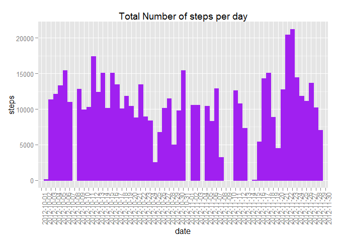
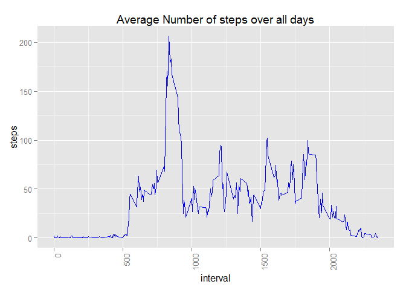
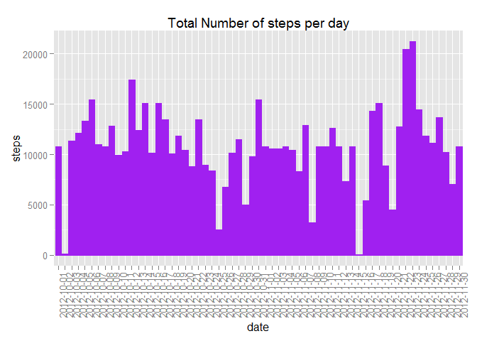
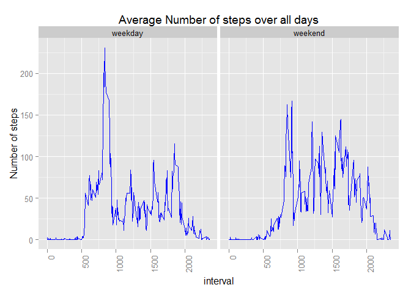

# Reproducible Research: Peer Assessment 1

This assignment uses data collected from a personal activity monitoring device at 5 min interval for 2 months during Oct and Nov 2012. The objective is to analyse the data to answer the following questions


## Loading and preprocessing the data

Lets load the data and analyse the data fields. We will ignnore the missing values in the dataset here

```r
txn <- read.csv("activity.csv")
str(txn)
```

```
## 'data.frame':	17568 obs. of  3 variables:
##  $ steps   : int  NA NA NA NA NA NA NA NA NA NA ...
##  $ date    : Factor w/ 61 levels "2012-10-01","2012-10-02",..: 1 1 1 1 1 1 1 1 1 1 ...
##  $ interval: int  0 5 10 15 20 25 30 35 40 45 ...
```

```r
summary(txn)
```

```
##      steps               date          interval   
##  Min.   :  0.0   2012-10-01:  288   Min.   :   0  
##  1st Qu.:  0.0   2012-10-02:  288   1st Qu.: 589  
##  Median :  0.0   2012-10-03:  288   Median :1178  
##  Mean   : 37.4   2012-10-04:  288   Mean   :1178  
##  3rd Qu.: 12.0   2012-10-05:  288   3rd Qu.:1766  
##  Max.   :806.0   2012-10-06:  288   Max.   :2355  
##  NA's   :2304    (Other)   :15840
```


## What is mean total number of steps taken per day?

Proceed to plot a histogram of the total number of steps per day


```r
#install.packages("ggplot2")
library(ggplot2)
```

```
## Warning: package 'ggplot2' was built under R version 3.1.3
```

```r
ggplot(txn, aes(x=date, y=steps)) +
  geom_bar(stat="identity", color = "purple",fill="purple") +
  labs(title = "Total Number of steps per day") +
  theme(axis.text.x = element_text(angle = 90, hjust = 1))
```

```
## Warning: Removed 2304 rows containing missing values (position_stack).
```

 

Now lets find out the mean and median total number of steps per day


```r
total_steps_day <- aggregate(steps~date, txn, sum)
mymean <- mean(total_steps_day$steps)
mymean
```

```
## [1] 10766
```

```r
mymedian <- median(total_steps_day$steps)
mymedian
```

```
## [1] 10765
```

The mean is 10766.19 and median is 10765


## What is the average daily activity pattern?


Lets plot a timeseries plot of 5-min interval with average number of steps across all days


```r
mean_steps_interval <- aggregate(steps~interval, txn, mean)

ggplot(mean_steps_interval, aes(x=interval, y=steps)) +
  geom_line(stat="identity", color = "blue",fill="blue") +
  labs(title = "Average Number of steps over all days") +
  theme(axis.text.x = element_text(angle = 90, hjust = 1))
```

 

So the 5-minute interval which contains the maximum number of steps is ...


```r
mean_steps_interval$interval_actual<-sprintf("%04d", mean_steps_interval$interval)
max_steps <- max(mean_steps_interval$steps)
max_steps
```

```
## [1] 206.2
```

```r
subset(mean_steps_interval, steps==max_steps, c("interval_actual"))
```

```
##     interval_actual
## 104            0835
```
during the 0835 to 0840 interval which has 206.1698 steps (highest peak in graph)


## Imputing missing values


So the total number of missing rows with NAs in the dataset is 2304

```r
sum(is.na(txn))
```

```
## [1] 2304
```

To impute the missing steps value for certain days and interval, we replace it with the mean steps of that interval and check that there are no more rows with NA values.


```r
txn_clean<-subset(txn, !is.na(steps),)
txn_not_clean<-subset(txn, is.na(steps),)

txn_not_clean_amd <- merge(txn_not_clean, mean_steps_interval, by="interval",all.x=T)
txn_not_clean_amd <- txn_not_clean_amd[,c("interval","date","steps.y")]
colnames(txn_not_clean_amd)<-c("interval","date","steps")

txn_amd <- rbind(txn_clean, txn_not_clean_amd)
sum(is.na(txn_amd))
```

```
## [1] 0
```
  
Proceed to plot a revised histogram of the total number of steps per day


```r
ggplot(txn_amd, aes(x=date, y=steps)) +
  geom_bar(stat="identity", color = "purple",fill="purple") +
  labs(title = "Total Number of steps per day") +
  theme(axis.text.x = element_text(angle = 90, hjust = 1))
```

 

Now lets find out the revised mean and median total number of steps per day and include in the chart


```r
total_steps_day_amd <- aggregate(steps~date, txn_amd, sum)
mymean_amd <- mean(total_steps_day_amd$steps)
mymean_amd
```

```
## [1] 10766
```

```r
mymedian_amd <- median(total_steps_day_amd$steps)
mymedian_amd
```

```
## [1] 10766
```

After imputing the values, the mean is 10766.19 which is the same as previously. The median has now changed
from 10765 to be the same as mean of 10766.19 which could be due to 2304 records being imputed with the mean value of the 5-min interval.


## Are there differences in activity patterns between weekdays and weekends?

Lets find the weekdays and weekends and check if there's differences in activity patterns by plotting a line chart by 5-min interval for 2 day types of average number of steps across all days


```r
txn_amd$day <- weekdays(as.Date(txn_amd$date))
txn_amd$day_cat <- ifelse(txn_amd$day%in% c("Saturday","Sunday"),"weekend","weekday")
txn_amd$day_cat <- as.factor(txn_amd$day_cat)

mean_steps_interval_amd <- aggregate(steps~interval+day_cat, txn_amd, mean)

ggplot(mean_steps_interval_amd, aes(x=interval, y=steps)) +
  geom_line(stat="identity", color = "blue",fill="blue") +
  labs(title = "Average Number of steps over all days") +
  theme(axis.text.x = element_text(angle = 90, hjust = 1)) + 
  facet_wrap(~day_cat) +
  ylab("Number of steps")
```

 

In general,  most number of steps were usually generated before 10am for both weekdays and weekends. However for weekends, there were also many steps generated between 10am and 3pm.
